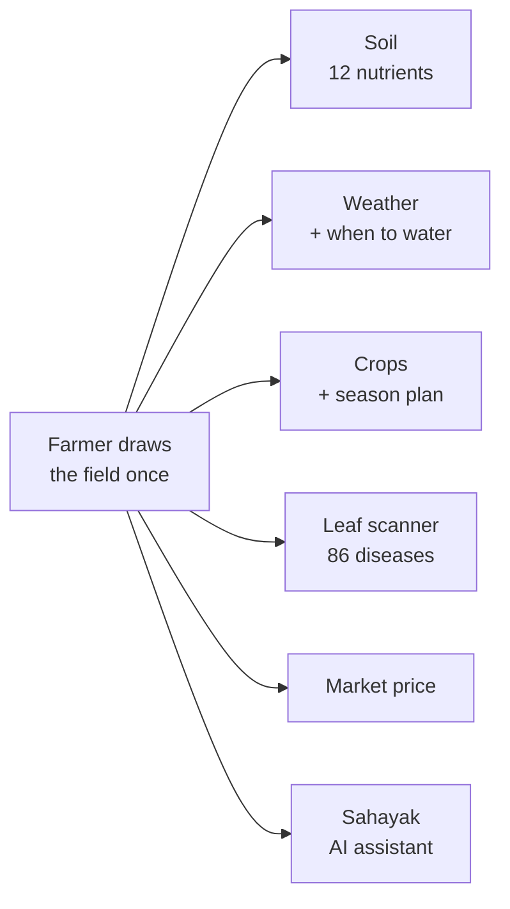
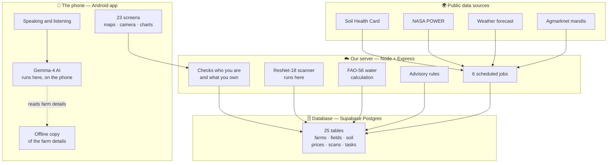

# Agronavis — The Complete Guide

Everything in this app, in plain words. Read it start to finish and you will
know what we built, how every part works, and where it falls short.

---

## Contents

1. [The problem](#1-the-problem)
2. [The solution](#2-the-solution)
3. [What the farmer actually sees](#3-what-the-farmer-actually-sees)
4. [Architecture](#4-architecture)
5. [Every model we use](#5-every-model-we-use)
6. [Where every number comes from](#6-where-every-number-comes-from)
7. [How we keep the data fresh](#7-how-we-keep-the-data-fresh)
8. [Security](#8-security)
9. [Working without internet](#9-working-without-internet)
10. [The numbers](#10-the-numbers)
11. [Advantages](#11-advantages)
12. [Disadvantages](#12-disadvantages)
13. [What we would build next](#13-what-we-would-build-next)
14. [The full stack](#14-the-full-stack)

---

## 1. The Problem

An Indian farmer makes four decisions every season. Each one costs real money
when it goes wrong. Each one is normally made with no data at all.

| The question                   | How it gets answered today                                      |
| ------------------------------ | --------------------------------------------------------------- |
| What is in my soil?            | The government tested it. The farmer has never seen the result. |
| When should I water?           | Guesswork, or waiting and hoping it rains.                      |
| What is this spot on the leaf? | Ask a neighbour, or buy whatever the shop recommends.           |
| What is my crop worth?         | Travel to the mandi and find out after arriving.                |

**Here is the important part: the answers already exist.**

- India tests its soil district by district and publishes the results.
- NASA publishes daily rainfall and sunlight for every point on Earth.
- The mandi network publishes prices.
- The UN publishes the exact formula for how much water a crop needs.

All of it is public. All of it is already paid for. None of it reaches the
person standing in the field.

> **The problem is not missing science. It is missing delivery.**

---

## 2. The Solution

Agronavis is an Android app that delivers those public records to one specific
field.

The farmer draws their field boundary on a satellite map, once. Everything after
that is about **that** field — not a district average, not a village estimate,
not the nearest weather station.



### Why "one field" is the whole idea

Most farming apps ask for a pincode or a village. Then they show everyone in
that area the same screen.

We ask for the boundary instead.

That one choice is why we can honestly say the numbers are specific. A farmer
can own two plots 300 km apart. In Agronavis those two plots show different
weather, different soil and different advice — because each one carries its own
location.

**We even calculate the field's area from the shape they drew.** The maths
accounts for the curve of the Earth, so the acreage is correct, and the farmer
never has to type it in.

---

## 3. What the Farmer Actually Sees

The app has 23 screens. Here is the journey through them.

### Step 1 — Getting started

| Screen               | What happens                                          |
| -------------------- | ----------------------------------------------------- |
| **Welcome**          | Choose to sign in or register                         |
| **Register / Login** | Account created with Supabase                         |
| **Two-factor**       | Optional extra security code                          |
| **Language**         | Pick English or Hindi — the whole app changes         |
| **Profile setup**    | Name, village, land, irrigation type, crops grown     |
| **Notifications**    | Turn on weather alerts, task reminders, pest warnings |

### Step 2 — Mapping the land

| Screen        | What happens                                 |
| ------------- | -------------------------------------------- |
| **My Farms**  | The list of farms                            |
| **Field map** | Draw the boundary on satellite imagery       |
| **Fields**    | Every mapped field, with its calculated area |

### Step 3 — The daily screens

| Screen             | What it shows                                                     |
| ------------------ | ----------------------------------------------------------------- |
| **Dashboard**      | Today's weather, the soil's NPK, open advisories, upcoming tasks  |
| **Soil report**    | Full breakdown of all 12 nutrients, with the evidence behind each |
| **Weather report** | The complete technical daily record behind the irrigation advice  |
| **Crops**          | Pick a crop from the list valid for your state                    |
| **AI Scanner**     | Photograph a leaf, get a reading                                  |
| **Mandi**          | Today's prices for your state                                     |
| **Sahayak**        | Ask anything, by typing or by speaking                            |
| **Community**      | Posts from other farmers                                          |
| **Profile**        | Details, language, security                                       |

---

## 4. Architecture

Three pieces: the phone, our server, and the database.



### The one rule everything follows

> **The app never talks to the database directly. Ever.**

Every single read and write goes through our server. The server is the only
thing that holds the database master key and the paid API keys.

**Why this matters, simply:** anyone can download an Android app and unzip it to
read the secrets inside. If the app talked to the database directly, the first
person to try could read and delete every farmer's data. Going through our
server means the dangerous keys never leave it — and the server checks _do you
actually own this field?_ before answering.

Our server has **12 modules** and **46 endpoints**:

| Module          | What it handles                             |
| --------------- | ------------------------------------------- |
| `auth`          | Identity and two-factor codes               |
| `farmers`       | The farmer's profile                        |
| `farms`         | Farms, fields, boundaries, area             |
| `soil`          | Soil readings per field                     |
| `weather`       | Current, forecast, solar, water balance     |
| `crops`         | Crop list, the scanner, the disease library |
| `tasks`         | The season's task list                      |
| `advisory`      | Generated advice                            |
| `market`        | Mandi prices and the mandi directory        |
| `community`     | Farmer posts                                |
| `notifications` | Push and in-app alerts                      |
| `storage`       | Photo uploads                               |

---

## 5. Every Model We Use

We use **eight** models. Two are neural networks. One is a physics equation.
Five are deliberately simple — because simple was the correct answer, not the
lazy one.

---

### 5.1 Gemma-4 — the assistant that lives on the phone

|                  |                                                                                          |
| ---------------- | ---------------------------------------------------------------------------------------- |
| **What it does** | Sahayak, the assistant the farmer talks to                                               |
| **Type**         | Large language model, Google's open-weight Gemma-4                                       |
| **Two sizes**    | E4B (3.4 GB) for bigger phones, E2B (2.4 GB) for smaller ones                            |
| **Runs on**      | LiteRT-LM, Google's on-device engine, through a native Android module we wrote ourselves |
| **Where**        | **On the farmer's phone.** Not on any server.                                            |
| **Weights from** | litert-community on Hugging Face — open, free, no account needed                         |

**How we pick the size:** the phone tells us how much memory it has, and we pick
the model that fits. There is a catch we handle: a phone sold as "8 GB" reports
9–11 GB, because that number includes graphics and system memory. So our cut-off
is 12 GB, not 8.

**Why running it on the phone is the big decision:**

- **It works with no signal.** A farmer in a field with one bar still gets
  answers. For rural software this is the single most important fact.
- **It costs nothing per question.** A cloud AI charges for every message. With
  a million farmers asking three questions a day, that bill ends the company.
  Ours is zero, permanently.
- **Nothing leaves the phone.** Questions about their own land are never sent
  anywhere.

**The honest cost:** it is a 2.4–3.4 GB download. The farmer does it once, over
Wi-Fi, and the app shows exactly what is happening while it downloads.

#### What the assistant actually knows

This is the part that makes it useful instead of generic. Before every
conversation we build a briefing for the model from the farmer's own records:

| We tell it                   | Example                                           |
| ---------------------------- | ------------------------------------------------- |
| Who they are                 | Name, village, district, state                    |
| Their land                   | "4.2 acres across 3 mapped fields"                |
| How they irrigate            | Drip, canal, rainfed                              |
| What they grow               | Their listed crops                                |
| Right now                    | "31°C, humid, 78%"                                |
| Their soil                   | "nitrogen Low, phosphorus High, potassium Medium" |
| Open advisories              | Up to 5 current warnings                          |
| **Which screen they are on** | "They are on the Mandi screen, where they can…"   |

Three rules are built into that briefing:

1. **Never invent a measurement.** If we do not have a figure, it is left out
   rather than guessed.
2. **Answer in their language.** Stated as a hard instruction, because models
   drift back to English otherwise.
3. **Only describe features the app really has.** So it cannot promise a button
   that does not exist.

And if the phone is offline, we tell the model that too — including how old the
information is — so it says "this was from four hours ago" instead of presenting
stale weather as current.

---

### 5.2 ResNet-18 — the leaf disease scanner

|                     |                                                               |
| ------------------- | ------------------------------------------------------------- |
| **What it does**    | Reads a photo of a leaf and names the disease                 |
| **Type**            | ResNet-18 — an 18-layer residual convolutional neural network |
| **Knows**           | 86 conditions across 21 crops                                 |
| **Sees**            | The photo shrunk to 224 × 224 pixels                          |
| **Says**            | The top 3 most likely conditions, each with a confidence      |
| **Confidence rule** | Under 50% is shown as a hint, not an answer                   |
| **File**            | Converted from PyTorch to ONNX — 42.8 MB                      |
| **Runs**            | Inside our own server                                         |
| **Speed**           | About 1 second per photo, 219 MB of memory                    |

**"Residual network" in plain words:** deep neural networks normally get _worse_
past a certain depth. The learning signal fades before it reaches the early
layers, like a message passed down a very long line of people. ResNet adds
shortcuts that skip layers, so the signal has a clear path back. That single
idea made very deep networks trainable, and it is one of the most cited results
in all of computer vision.

#### The engineering decision we are proudest of

The original version of this scanner needed PyTorch, Transformers and CLIP —
about **1.1 GB of libraries loaded before a single request arrives.**

Our server has **512 MB of memory.** It could not even start.

So we converted the same trained weights to a format called ONNX. The result is
**42.8 MB and runs in 219 MB of memory**, inside the same server as everything
else.

We checked the conversion was faithful. Across the model's entire output, the
largest disagreement between the original and the converted version was
**0.00000763**, and both picked the same answer every time.

> That is the difference between a demo and something that actually runs.

---

### 5.3 The vegetation check — what stops it reading your face

Most teams skip this. It is the most important thing in the scanner.

**The problem:** a classifier trained on 86 leaf diseases _must_ return one of
those 86 labels for anything you show it. A wall, a hand, the sky — it returns a
crop disease, confidently. It has no label for "that is not a leaf" and no way
to learn one.

We measured this on our own model:

| What we showed it | Its top score |
| ----------------- | ------------- |
| A healthy leaf    | 3.43          |
| **A grey wall**   | **4.53**      |
| Human skin        | 0.59          |

**A grey wall scored higher than a healthy leaf.** No confidence threshold can
fix that. The model simply does not have the concept.

So before the classifier is allowed an opinion, we check the picture for plants.

|               |                                                                        |
| ------------- | ---------------------------------------------------------------------- |
| **Method**    | Excess Green Index — the standard field test for vegetation            |
| **The sum**   | (2×Green − Red − Blue) ÷ (Red + Green + Blue) must exceed 0.08         |
| **Too dark**  | Pixels where Red+Green+Blue is under 90 are skipped — no usable colour |
| **Threshold** | At least 15% of the photo must look like plant                         |
| **Cost**      | One pass over the pixels. No model, no memory, no delay                |
| **Published** | Woebbecke and others, 1995                                             |

**Why we divide by (Red + Green + Blue):** without it, the test measures
brightness as much as colour. A grey wall sits near zero, and camera noise alone
pushed a third of its pixels over the line. Dividing each colour by the pixel's
total makes grey _exactly_ zero however bright or noisy it is — and makes a leaf
in shade score the same as a leaf in full sun.

#### This is a real bug we shipped, found, and fixed

The first version also counted any "warm" pixel — red above blue, green above
blue — so that browning diseased leaves would pass.

That rule is a textbook description of human skin.

A selfie came back as **healthy rice, 78% confident.**

We removed the rule. The index is now green-led only, and tested against 19
colours:

```
ACCEPTS   healthy leaf · rice leaf · leaf in deep shade · leaf in full sun
          chlorotic yellowing · pale yellow leaf · amber early blight

REFUSES   skin in 5 tones · bare wood · beige wall · blue sky
          grey concrete · white paper · red shirt · an unlit room
```

**What we gave up:** a completely brown, dead leaf with no green left is now
refused.

We think that is the right trade. A farmer told to retake a photo loses a
moment. A farmer told their own face is healthy rice has no reason to trust
anything else in the app.

---

### 5.4 MobileNetV2 — built, deliberately switched off

|                      |                                                          |
| -------------------- | -------------------------------------------------------- |
| **What it would do** | Properly decide "is this a crop?"                        |
| **Type**             | MobileNetV2 trained on ImageNet — 1,000 everyday objects |
| **Size**             | 14 MB                                                    |
| **Status**           | **Written, tested, and not turned on**                   |

Colour catches skin, walls and sky. It cannot catch a green thing that is not a
plant — a painted wall, a green shirt. MobileNetV2 knows a thousand ordinary
objects, many of them leaves, fruit and vegetables, so we can ask it how much of
the picture looks like something growing.

We have not switched it on, because its threshold must be measured against real
photographs of real diseased leaves in real light. **A guessed threshold would
start refusing exactly the photos the scanner exists to read.**

The code is committed, with a header explaining how to finish it.

> We think leaving this off is worth more than turning it on. Shipping an
> uncalibrated gate would be the same mistake as the face-as-rice bug, just in
> the other direction.

---

### 5.5 FAO-56 Penman–Monteith — the irrigation answer

|                  |                                                              |
| ---------------- | ------------------------------------------------------------ |
| **What it does** | Works out how much water the crop loses in a day             |
| **Type**         | A physics equation. Not machine learning.                    |
| **Published by** | The UN Food and Agriculture Organization, Paper 56, 1998     |
| **Needs**        | Sunlight, temperature, humidity, wind, latitude, day of year |
| **Gives**        | ET₀ — millimetres of water lost per day                      |

This is the standard the irrigation engineering world actually uses. It is not a
rule of thumb like "water every three days".

**We implemented the full equation**, with every sub-calculation the paper
specifies: sunshine reaching the top of the atmosphere, how much is lost to
cloud, the vapour pressure deficit, the psychrometric constant, air pressure
adjusted for altitude.

> **We checked our version against the worked example the FAO publishes with
> the paper, and it reproduces their answer.**

That is the difference between claiming a standard and meeting it.

**Then we turn it into advice.** We add up ET₀ leaving the field and rainfall
entering it over the last three days. The gap is the water deficit:

| Deficit    | What we tell the farmer                                                    |
| ---------- | -------------------------------------------------------------------------- |
| Over 18 mm | **Irrigate today**, before 9 am, roughly this many m³ per acre             |
| Over 10 mm | **Irrigate within 48 hours**                                               |
| Over 4 mm  | **Check soil moisture** — dig 15 cm; if it crumbles, water within 3 days   |
| Under 4 mm | _Say nothing._ A healthy field is not news, and a full inbox gets ignored. |

Note the last row. Knowing when to stay quiet is a design decision.

---

### 5.6 The advisory rules — plain logic, no AI

Not everything needs a model. These are simple rules over the weather forecast,
and that is a strength: a rule can be explained to a farmer, and it cannot
hallucinate.

| Trigger                                         | What we say                                                                                 |
| ----------------------------------------------- | ------------------------------------------------------------------------------------------- |
| Over 30 mm rain, or 80%+ chance                 | Hold back fertiliser and spray — both wash off. Clear your drains.                          |
| 42°C or hotter                                  | Water before sunrise or after sunset only. Mulch bare soil. Flowers drop pollen above 40°C. |
| Wind 45 km/h or more                            | Do not spray — drift wastes the chemical and hits your neighbour's field.                   |
| 2+ humid mild days (over 85% humidity, 18–32°C) | Fungal risk rising. Scout the lower leaves each morning.                                    |

That last rule is worth explaining. Long leaf wetness with warm nights is the
classic window for blast and blight. **Warning about the conditions is far
cheaper for the farmer than treating the outbreak.**

---

### 5.7 The soil rating — counting, done honestly

Each district's Soil Health Card record holds counts: how many soil samples came
back High, Medium and Low for each nutrient.

We add them up and show the band with the most samples. But we also show:

- **The full split as a bar** — so 60/40 does not look the same as 99/1
- **How many samples** the reading is based on
- **A warning** when a district has only been tested a handful of times
- **If there is no district record**, we widen to the state and say so — rather
  than inventing a number

Twelve things are measured: nitrogen, phosphorus, potassium, organic carbon,
pH, salinity, sulphur, iron, zinc, copper, boron and manganese.

---

### 5.8 The market price — a median, not an average

For each crop we take the **median** price across all the mandis reporting in
that state, and show the lowest and highest beside it, plus which mandis
reported.

**Why median and not average:** one unusual mandi should not move the number a
farmer plans around. If nine mandis say ₹2,000 and one says ₹8,000, the average
is ₹2,600 and the median is ₹2,000. The median is the honest one.

---

## 6. Where Every Number Comes From

| What the farmer sees        | Source                           | Who owns it          |
| --------------------------- | -------------------------------- | -------------------- |
| Soil nutrients              | Soil Health Card survey          | Government of India  |
| Rain and sunlight           | POWER satellite record           | NASA                 |
| Temperature, humidity, wind | Live weather service             | OpenWeatherMap       |
| Water requirement           | Penman–Monteith equation         | United Nations FAO   |
| Mandi prices                | Agmarknet reporting network      | Government of India  |
| Crop lists                  | Fertiliser recommendation scheme | Government of India  |
| Disease reading             | Our own trained model            | Agronavis            |
| Conversation                | Gemma-4, on the phone            | Google, open weights |

**Six of the eight come from public institutions or open models.**

We are not asking a farmer to trust our opinion. We deliver records that already
exist, to the field they belong to. That is also far easier to take to a
government department or a cooperative than "trust our algorithm".

---

## 7. How We Keep the Data Fresh

Six jobs run on a schedule on our server. Each one is wrapped so that a failure
is logged and never crashes anything else.

| Job                  | What it fetches                                |
| -------------------- | ---------------------------------------------- |
| **Weather poll**     | Conditions and forecasts for every mapped farm |
| **Market poll**      | Today's mandi prices                           |
| **Catalogue sync**   | The directory of 4,172 mandis                  |
| **Soil sync**        | Soil Health Card records, district by district |
| **Fertiliser crops** | Which crops each state's scheme recognises     |
| **Mandi mirror**     | A backup price source                          |

We also cache aggressively, so we are polite to the sources and fast for the
farmer:

| Data            | Kept for   |
| --------------- | ---------- |
| Current weather | 30 minutes |
| Forecast        | 30 minutes |
| NASA solar data | 12 hours   |

**One neat trick:** we round coordinates to about 1 km when caching. Neighbouring
farms then share the same weather lookup instead of making the same call twice.

---

## 8. Security

| What                      | How                                                          |
| ------------------------- | ------------------------------------------------------------ |
| **Sign-in**               | Supabase Auth                                                |
| **Every request checked** | The phone's token is verified against Supabase's public keys |
| **Ownership checked**     | The server confirms you own the field before answering       |
| **Two-factor**            | Optional TOTP, the same as Google Authenticator              |
| **The 2FA secret**        | Encrypted before it is stored, never kept in plain text      |
| **Clock drift**           | ±30 seconds allowed, because cheap handsets drift            |
| **Database protection**   | Row Level Security as a second line of defence               |
| **Standard protections**  | Security headers, rate limiting, strict request size limits  |
| **Keys in the app**       | Only ones that are safe to publish                           |

That last row again, because it is the important one: **anyone can unzip an
Android app and read the keys inside it.** So the app only ever carries keys
that do not matter if they leak. Everything dangerous lives on the server.

---

## 9. Working Without Internet

Rural connectivity is the thing most agri apps quietly assume away. We did not.

| Part                         | Offline?                                              |
| ---------------------------- | ----------------------------------------------------- |
| **Sahayak AI**               | ✅ Fully — the model is on the phone                  |
| **Farm details for Sahayak** | ✅ Saved on the phone, so the AI still knows the farm |
| **Mandi prices**             | ✅ Last known prices, with their date                 |
| **Leaf scanner**             | ❌ Needs the server                                   |
| **Fresh weather**            | ❌ Needs a connection                                 |

**The detail we are pleased with:** the AI runs on the phone, but the farm
details behind its answers normally come from the server. Without a local copy,
opening Sahayak offline would give you a model that works perfectly and knows
nothing about your farm.

So we keep a copy on the phone, saved per user, and we tell the model how old it
is. It then says "based on details from this morning" rather than pretending.

---

## 10. The Numbers

Counts from the live production database, not projections.

|            |                               |
| ---------- | ----------------------------- |
| **712**    | districts with soil data      |
| **32**     | states and territories        |
| **11,332** | market price records          |
| **1,491**  | mandis reporting prices       |
| **225**    | crops with a price            |
| **4,172**  | mandis in the directory       |
| **1,812**  | crops in the scheme catalogue |
| **86**     | diseases the scanner knows    |
| **21**     | crops the scanner covers      |
| **23**     | app screens                   |
| **46**     | API endpoints                 |
| **25**     | database tables               |
| **2**      | languages live                |

---

## 11. Advantages

**It runs on free infrastructure.** The whole server — API, scanner, six
scheduled jobs — fits in 512 MB of memory. That was not luck. It is why the
scanner was converted to ONNX.

**The AI costs nothing per use.** The assistant runs on the phone. There is no
per-message bill that grows as we succeed.

**It works without signal.** The assistant is on-device. Prices are cached. The
farm details are saved locally.

**Six of eight sources are public.** We deliver records the state already
produced, rather than asking anyone to trust our agronomy.

**It admits what it does not know.** Refuses non-crop photos. Labels weak
readings as hints. Shows soil sample counts. Says when it widened from district
to state. Shows the full weather record behind the advice. Stays silent when
there is no news.

**Everything is tied to one field,** with the area calculated from the drawn
shape.

**Voice in and voice out,** so a farmer who cannot read comfortably can still
use every part of it.

**It is genuinely built, not mocked.** 23 screens, 46 endpoints, 25 tables, 111
automated tests.

---

## 12. Disadvantages

Being straight about these is worth more than hiding them.

**The on-device AI is a 2.4–3.4 GB download.** On rural mobile data that is a
real barrier. It is a one-time Wi-Fi download, but we are not pretending it is
nothing.

**Soil data is district-level, not your field.** The Soil Health Card tests
samples across a district. It is survey data, not a test of this specific plot.
We show the sample count so the farmer can judge.

**86 diseases is not every disease in India.** Photograph something outside
those 86 and the model picks the closest thing it knows. The confidence score
and the "confirm before spraying" warning are what stand between that and a
wrong purchase.

**A fully brown dead leaf gets refused.** The deliberate cost of the vegetation
check.

**The green check reads colour, not meaning.** A green painted wall would pass
it. That is exactly what MobileNetV2 is for, and it is not switched on yet.

**The scanner needs a connection.** Unlike the assistant, it runs on the server.

**Only 11 crops have full task timelines**, out of 1,812 in the catalogue. And
those timelines are currently four fixed milestones — sowing, fertiliser at 21
days, a pest scan at 45 days, harvest at the crop's own duration — not a
stage-by-stage agronomic plan.

**Only 2 languages are live.** India has twenty-two scheduled languages.

**Prices cover 23 states of 36,** and the national source is unreliable.

**The free server sleeps.** After 15 minutes idle, the first request takes about
10 seconds to wake it.

**No treatment text yet.** The 86 conditions are named, but their symptom and
treatment fields are deliberately empty rather than filled with text we could
not verify. Wrong spraying advice is worse than none.

**Duplicate crop labels.** The training data has both "grape" and "grapes". A
cosmetic data-quality issue, visible in the scanner's crop filter.

**No satellite crop monitoring.** We use NASA POWER for weather, but we do not
yet look at the field from orbit. See the next section.

---

## 13. What We Would Build Next

### Near term

1. **Switch on the MobileNetV2 crop check.** Collect real leaf photographs,
   measure the threshold, enable it. The code is already written.
2. **Five more languages** — Marathi, Punjabi, Gujarati, Telugu, Kannada.
3. **Dose, not just advice.** Fertiliser and pesticide quantities calculated for
   the field's actual acreage — which we already know, because we measured the
   polygon.
4. **Verified treatment text**, written against CIB&RC-approved actives, so the
   library can advise and not only identify.

### Medium term — satellite crop monitoring

This is the biggest missing capability, and it deserves its own section.

**What it is:** the European Space Agency's **Sentinel-2** satellites photograph
every point on Earth every five days, in colours the human eye cannot see —
including near-infrared. Healthy plants reflect near-infrared strongly;
stressed plants do not. The ratio is called **NDVI**, and it reveals crop stress
days before it is visible on the ground.

**Why it fits us perfectly:** we already have the field's exact boundary. That
is the hard part, and we solved it on day one. Sentinel-2 data is free.

**What it would give the farmer:**

|                                     |                                                                   |
| ----------------------------------- | ----------------------------------------------------------------- |
| **A stress map of the whole field** | Not one leaf — every square metre                                 |
| **Early warning**                   | Problems visible from orbit before they are visible from the path |
| **Which corner is struggling**      | So fertiliser goes where it is needed                             |
| **Change over the season**          | Is the crop ahead or behind where it should be?                   |

> Today our scanner answers "what is wrong with **this leaf**". Sentinel-2 would
> answer "which **part of my field** is in trouble". Those are different
> questions and farmers need both.

5. **Task timelines for every crop**, with real agronomic stages rather than
   four fixed milestones.
6. **A smaller on-device model option**, so mid-range phones can run the
   assistant without a 2.4 GB download — compressed, or a smaller model trained
   specifically for agriculture.
7. **Yield prediction** from the soil, weather and crop data we already hold.

### Longer term

8. **Train our own disease model on Indian field photographs.** The current one
   learned largely from clean, laboratory-style images. A real photo taken at
   noon in a dusty field looks different.
9. **Offline-first everything**, so the whole app works with no connection and
   syncs when it finds one.
10. **Farmer-to-farmer verification** — let farmers confirm or correct a
    diagnosis, and use that to improve the model.
11. **Government and cooperative integration** — push advisories through
    extension officers, who already have farmers' trust.

---

## 14. The Full Stack

| Layer        | Built with                                                  |
| ------------ | ----------------------------------------------------------- |
| App          | React Native 0.81, Expo SDK 54, Expo Router, React 19       |
| State        | Zustand, TanStack Query                                     |
| Maps         | react-native-maps                                           |
| On-device AI | Gemma-4 via LiteRT-LM, in a native Android module we wrote  |
| Voice        | expo-speech (speaking), expo-speech-recognition (listening) |
| Languages    | i18next — 97 phrases in English and Hindi                   |
| Server       | Node 22, Express, TypeScript                                |
| Live updates | Socket.IO, plus Expo push notifications                     |
| Vision       | onnxruntime-node, sharp                                     |
| Validation   | Zod on every incoming request                               |
| Database     | Supabase — Postgres, Auth, Storage, Row Level Security      |
| Hosting      | Render (server, free tier), Supabase (database)             |
| Scheduling   | node-cron — 6 jobs                                          |
| Tests        | 111 automated tests (39 app, 72 server)                     |

---

## If You Remember One Thing

Most teams building this would call a cloud vision API and a cloud AI, and have
a working demo in a weekend.

We put both models where they actually need to be — the scanner inside our own
server, the assistant on the farmer's phone — so the running cost is near zero,
it works without signal, and no farmer's data leaves their device.

And we made it say **"I am not sure"**, because a farmer forgives an app that
admits doubt, and never opens one again after it was confidently wrong.

---

### References

| Used for                       | Source                                                                                             |
| ------------------------------ | -------------------------------------------------------------------------------------------------- |
| Water requirement              | Allen, Pereira, Raes & Smith (1998). _Crop Evapotranspiration._ FAO Irrigation & Drainage Paper 56 |
| Scanner architecture           | He, Zhang, Ren & Sun (2016). _Deep Residual Learning for Image Recognition._ CVPR                  |
| Crop detection in frame        | Woebbecke, Meyer, Von Bargen & Mortensen (1995). _Color Indices for Weed Identification._ ASAE     |
| Efficient mobile vision        | Sandler, Howard, Zhu, Zhmoginov & Chen (2018). _MobileNetV2._ CVPR                                 |
| On-device language model       | Gemma, Google DeepMind — open weights via litert-community                                         |
| Sunlight and rainfall          | NASA POWER, NASA Langley Research Center                                                           |
| Soil nutrients                 | Soil Health Card scheme, Department of Agriculture & Farmers Welfare, Government of India          |
| Market prices                  | Agmarknet, Directorate of Marketing & Inspection, Government of India                              |
| Satellite monitoring (planned) | Sentinel-2, Copernicus Programme, European Space Agency                                            |
