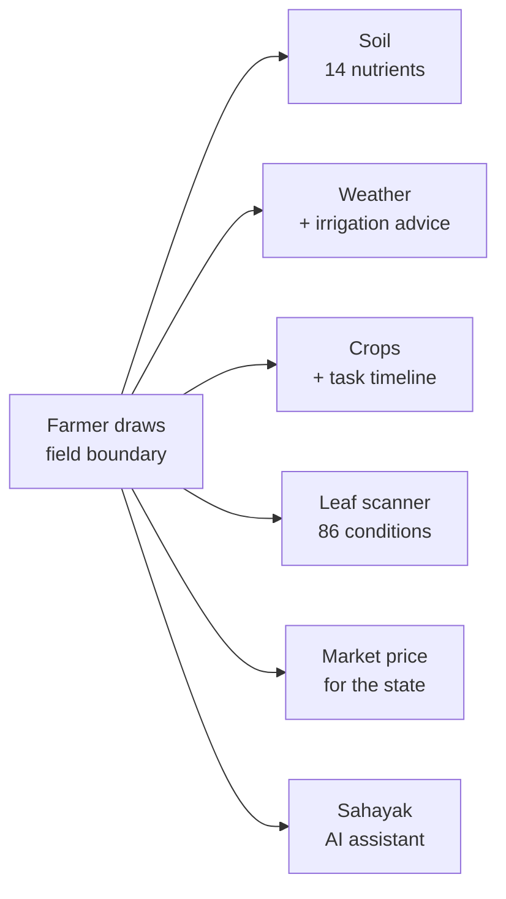
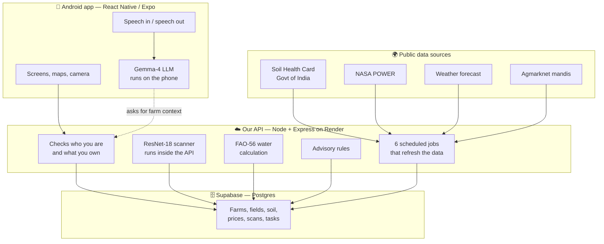

# Agronavis — How It Works

A walkthrough of the problem, the solution, every model we use, and what we got
right and wrong. Written to be read start to finish.

---

## 1. The Problem

An Indian farmer makes four decisions every season. Each one costs real money
when it goes wrong, and each one is normally made with no data at all.

| The question                   | How it gets answered today                                      |
| ------------------------------ | --------------------------------------------------------------- |
| What is in my soil?            | The government tested it. The farmer has never seen the result. |
| When should I water?           | Guesswork, or waiting and hoping it rains.                      |
| What is this spot on the leaf? | Ask a neighbour, or buy whatever the shop recommends.           |
| What is my crop worth?         | Travel to the mandi and find out after arriving.                |

Here is the part that matters: **the answers already exist.** India tests its
soil district by district and publishes the results. NASA publishes daily
rainfall and sunlight for every point on Earth. The mandi network publishes
prices. The UN publishes the formula for crop water requirement.

All of it is public. None of it reaches the person standing in the field.

**The problem is not missing science. It is missing delivery.**

---

## 2. The Solution

Agronavis is a mobile app that delivers those public records to one specific
field.

The farmer draws their field boundary on a satellite map, once. Everything after
that is about _that_ field — not a district average, not a village estimate, not
the nearest weather station.



Six answers, one boundary.

### Why "one field" is the whole design

Most agriculture apps ask for a pincode or a village and then show everyone in
that area the same screen. We ask for the boundary instead.

That one choice is why we can honestly claim the numbers are specific. A farmer
can own two plots 300 km apart; in Agronavis they read differently, because each
field carries its own coordinates.

---

## 3. Architecture



### The one rule the architecture follows

**The app never touches the database directly.**

Every read and write goes through our API. The API is the only thing holding the
database master key and the third-party API keys. The app only ever holds keys
that are safe to publish.

Why this matters: anyone can unzip an Android APK and read the keys inside it.
If the app talked to the database directly, the first person to download it
could read and delete every farmer's data. Going through the API means the
dangerous keys never leave our server, and the API checks _you own this field_
before it answers.

---

## 4. Every Model We Use

We use six models. Two are neural networks, one is a physics equation, and three
are deliberately simple — because simple was the right answer.

### 4.1 Gemma-4 — the assistant that runs on the phone

|                   |                                                                                 |
| ----------------- | ------------------------------------------------------------------------------- |
| **What it does**  | Sahayak, the AI assistant the farmer talks to                                   |
| **Architecture**  | Gemma-4, Google's open-weight language model                                    |
| **Variants**      | E4B (3.4 GB) on big phones, E2B (2.4 GB) on smaller ones                        |
| **How it runs**   | LiteRT-LM, Google's on-device runtime, through a native Android module we wrote |
| **Where it runs** | **On the phone.** Not on a server.                                              |
| **Weights from**  | litert-community on Hugging Face — open, no account, no key                     |

The phone reports its RAM, and we pick the variant that fits. Retail "8 GB"
phones report 9–11 GB because the figure includes GPU and kernel memory, so the
cut-off is set at 12 GB rather than 8.

**Why on-device is the interesting decision:**

- **It works with no signal.** A farmer in a field with one bar still gets
  answers. This is the single most important fact about rural software.
- **It costs nothing per question.** A cloud LLM charges per message. At a
  million farmers asking three questions a day, that bill ends the company.
  Ours is zero, forever.
- **Nothing leaves the phone.** The farmer's questions about their own land are
  never sent anywhere.

The trade-off is honest: it is a 2.4–3.4 GB download, so the farmer downloads it
once over Wi-Fi, and the app tells them exactly what is happening while it does.

### 4.2 ResNet-18 — the leaf disease scanner

|                  |                                                                |
| ---------------- | -------------------------------------------------------------- |
| **What it does** | Reads a photo of a leaf and names the disease                  |
| **Architecture** | ResNet-18 — an 18-layer residual convolutional network         |
| **Knows**        | 86 conditions across 21 crops                                  |
| **Input**        | 224 × 224 pixels, ImageNet normalisation                       |
| **Output**       | Top 3 conditions with confidence; under 50% is labelled a hint |
| **Format**       | Exported from PyTorch to ONNX — 42.8 MB                        |
| **Runs in**      | The API process itself, via onnxruntime-node                   |
| **Speed**        | About 1 second per photo, 219 MB of memory                     |

**"Residual network" in plain language:** deep neural networks normally get
_worse_ past a certain depth, because the learning signal fades before it
reaches the early layers. ResNet adds shortcut connections that skip layers, so
the signal has a clear path back. That one idea made very deep networks trainable
and is one of the most cited results in computer vision.

**The engineering decision we are proud of:** the original version of this
scanner needed PyTorch, Transformers and CLIP — about **1.1 GB of libraries
loaded before a single request arrives.** Our server has 512 MB of memory. It
could not even start.

So we exported the same trained weights to ONNX. The result is 42.8 MB and runs
in 219 MB of memory, inside the same API process. We checked the conversion was
faithful: the largest disagreement between the PyTorch model and the ONNX model
across the full output was **0.00000763**, and both picked the same answer.

That is the difference between a demo and something that actually runs on a free
server tier.

### 4.3 The vegetation check — what stops it reading your face

This is the part most teams skip, and it is the most important thing in the
scanner.

**The problem:** a classifier trained on 86 leaf diseases _must_ return one of
those 86 labels for any image it is given. Show it a wall, a hand, the sky — it
returns a crop disease, confidently. It has no label for "that is not a leaf"
and no way to learn one.

We measured this directly on our own model:

| What we showed it | Its top score |
| ----------------- | ------------- |
| A healthy leaf    | 3.43          |
| **A grey wall**   | **4.53**      |
| Human skin        | 0.59          |

**A grey wall scored higher than a healthy leaf.** No threshold on the model's
own confidence can fix that.

So before the classifier is allowed an opinion, we check the picture for plants.

|               |                                                                |
| ------------- | -------------------------------------------------------------- |
| **Method**    | Excess Green Index — the standard field test for vegetation    |
| **Formula**   | (2G − R − B) ÷ (R + G + B) > 0.08                              |
| **Also**      | Pixels darker than R+G+B = 90 are skipped as too dark to judge |
| **Threshold** | At least 15% of the frame must look like plant                 |
| **Cost**      | One pass over the pixels — no model, no memory                 |
| **Paper**     | Woebbecke et al., 1995                                         |

**Why we divide by (R + G + B):** without it, the test measures brightness as
much as colour. A grey wall sits near zero, and camera noise alone pushed a
third of its pixels over the line. Dividing each channel by the pixel's total
makes grey _exactly_ zero however bright or noisy it is, and makes a leaf in
shade score the same as a leaf in sunlight.

**This is a real bug we shipped and fixed.** The first version also counted any
"warm" pixel — red above blue, green above blue — so that browning diseased
leaves would pass. That rule is a textbook description of human skin. A selfie
came back as **healthy rice, 78% confident.**

We removed it. The index is now green-led only, and tested against 19 colours:

```
ACCEPTS  healthy leaf · rice leaf · leaf in deep shade · leaf in full sun
         chlorotic yellowing · pale yellow leaf · amber early blight

REFUSES  skin (5 tones) · bare wood · beige wall · blue sky
         grey concrete · white paper · red shirt · an unlit room
```

What we gave up: a fully brown, dead leaf with no green left is now refused. We
think that is the right trade. A farmer told to retake a photo loses a moment. A
farmer told their own face is healthy rice has no reason to trust anything else
in the app.

### 4.4 MobileNetV2 — built, deliberately switched off

|                      |                                                                                |
| -------------------- | ------------------------------------------------------------------------------ |
| **What it would do** | Decide "is this a crop?" properly, using a model that has seen the whole world |
| **Architecture**     | MobileNetV2 trained on ImageNet — 1,000 everyday object classes                |
| **Size**             | 14 MB                                                                          |
| **Status**           | **Written, tested, and not enabled**                                           |

Colour catches skin, walls and sky. It cannot catch a green object that is not a
plant — a painted wall, a green shirt. MobileNetV2 knows a thousand ordinary
things, many of them leaves, fruit and vegetables, so we can ask it how much of
the picture looks like something growing.

We are not switching it on yet, because its threshold has to be measured against
real photographs of real diseased leaves in real light. A guessed threshold
would start refusing exactly the photos the scanner exists to read. The code is
committed with a header explaining how to finish it.

**We think leaving this off is worth more than turning it on.** Shipping an
uncalibrated gate would be the same class of mistake as the face-as-rice bug.

### 4.5 FAO-56 Penman–Monteith — the irrigation answer

|                  |                                                           |
| ---------------- | --------------------------------------------------------- |
| **What it does** | Works out how much water the crop loses in a day          |
| **Type**         | A physics equation, not machine learning                  |
| **Published by** | The UN Food and Agriculture Organization, Paper 56 (1998) |
| **Inputs**       | Solar radiation, temperature, humidity, wind              |
| **Output**       | ET₀ in millimetres of water per day                       |

This is the standard the irrigation engineering world actually uses. It is not a
rule of thumb like "water every three days".

**We checked our implementation against the worked example the FAO publishes
with the paper, and it reproduces their answer.** That is the difference between
claiming a standard and meeting it.

Inputs come from the field's own coordinates: solar radiation and rainfall from
NASA POWER, with temperature, humidity and wind from the live forecast. ET₀
measured against recent rain is the irrigation decision.

### 4.6 The simple ones

**Soil rating.** Each district's Soil Health Card record holds counts: how many
samples came back High, Medium and Low for each nutrient. We sum them and show
the band with the most samples, _plus the full split as a bar, plus the sample
count._ A thinly tested district is flagged as thin evidence. No district record
at all? The reading widens to the state and says so, rather than inventing a
number.

**Market price.** A median across the state's reporting mandis, with the low and
high beside it, and the mandis listed. A median rather than an average because
one unusual mandi should not move the number a farmer plans around.

**Advisories.** Plain rules over the data — irrigation from the water deficit,
weather warnings from the forecast, disease risk from humidity and temperature.
No model, because none is needed, and a rule can be explained to a farmer.

---

## 5. Advantages

**It runs on free infrastructure.** The whole backend — API, scanner, six
scheduled jobs — fits in 512 MB of RAM. That was not luck; it is why the scanner
was converted to ONNX.

**The AI costs nothing per use.** The assistant runs on the phone. No per-message
bill that grows with success.

**It works without signal.** The assistant is on-device. Market prices are cached
locally, so the screen still works when the government source is down — and it
goes down for weeks at a time.

**Five of six data sources are public institutions.** We are not asking anyone to
trust our agronomy. We deliver records the state already produced. That is also
much easier to take to a government or cooperative partner.

**It admits what it does not know.** Refuses non-crop photos. Labels weak
readings as hints. Shows soil evidence and sample counts. Says when it widened
from district to state. Shows the full weather record behind the advice.

**Everything is scoped to one field,** not a pincode.

**Voice in and out, in English and Hindi,** so a farmer who cannot read
comfortably can still use every part of it.

---

## 6. Disadvantages — honestly

**The on-device model is a 2.4–3.4 GB download.** On rural mobile data that is a
real barrier. It is a one-time Wi-Fi download, but we are not pretending it is
nothing.

**Soil data is district-level, not your field.** The Soil Health Card tests
samples across a district; it is not a test of this specific plot. We show the
sample count so the farmer can judge, but it is survey data, not a soil test.

**86 conditions is not every disease in India.** If a farmer photographs
something outside those 86, the model picks the closest thing it knows. The
confidence score and the "confirm before spraying" warning are what stand
between that and a wrong purchase.

**A fully brown dead leaf gets refused.** The deliberate cost of the vegetation
check.

**The green check is colour, not understanding.** A green painted wall would pass
it. That is exactly what MobileNetV2 is for, and it is not switched on yet.

**Only 11 crops have full task timelines,** out of 1,812 in the catalogue.

**Only 2 languages are live** — English and Hindi. India has twenty-two
scheduled languages.

**Market prices are not live everywhere.** 23 states out of 36, and the national
source is unreliable.

**The free server sleeps.** After 15 minutes idle the first request takes about
10 seconds to wake it.

**No treatment text yet.** The 86 conditions are named but their symptom and
treatment fields are deliberately empty rather than filled with text we could
not verify. Wrong spraying advice is worse than none.

---

## 7. What We Would Build Next

**Near term**

1. **Switch on the MobileNetV2 crop check** — collect real leaf photographs,
   measure the threshold, enable it.
2. **Five more languages** — Marathi, Punjabi, Gujarati, Telugu, Kannada.
3. **Dose, not just advice** — fertiliser and pesticide quantities calculated for
   the field's actual acreage, rather than a general recommendation.
4. **Verified treatment text** — written against CIB&RC-approved actives, so the
   library can advise and not only identify.

**Medium term**

5. **Task timelines for every crop** in the catalogue, not 11.
6. **A smaller on-device model option** so mid-range phones can run the assistant
   without a 2.4 GB download — quantised, or a distilled agriculture-specific
   model.
7. **Satellite crop health (NDVI)** from Sentinel-2, which is free and would show
   stress across the whole field rather than one leaf.
8. **Yield prediction** from the soil, weather and crop data we already hold.

**Longer term**

9. **Train our own disease model on Indian field photographs** — the current one
   learns largely from clean laboratory-style images, and a real photo taken at
   noon in a field looks different.
10. **Offline-first everything,** so the whole app works with no connection and
    syncs when it finds one.
11. **Farmer-to-farmer verification** — let farmers confirm or correct a
    diagnosis, and use that to improve the model.
12. **Government and cooperative integration** — push advisories through
    extension officers who already have farmers' trust.

---

## 8. The Numbers

Counts from the live production database, not projections.

|            |                               |
| ---------- | ----------------------------- |
| **712**    | districts with soil data      |
| **32**     | states and territories        |
| **11,332** | market price records          |
| **1,491**  | mandis reporting prices       |
| **4,172**  | mandis in the directory       |
| **1,812**  | crops in the scheme catalogue |
| **86**     | crop conditions recognised    |
| **2**      | languages live                |

---

## 9. The Stack

| Layer          | Built with                                                      |
| -------------- | --------------------------------------------------------------- |
| App            | React Native 0.81, Expo SDK 54, Expo Router                     |
| On-device AI   | Gemma-4 via LiteRT-LM, in a native Android module               |
| Voice          | expo-speech (speaking), expo-speech-recognition (listening)     |
| API            | Node 22, Express, TypeScript, Socket.IO                         |
| Vision         | onnxruntime-node, sharp                                         |
| Database       | Supabase — Postgres, Auth, Storage, Row Level Security          |
| Hosting        | Render (API, free tier), Supabase (database)                    |
| Scheduled jobs | node-cron — 6 jobs refreshing soil, weather, prices, catalogues |

---

## 10. If You Remember One Thing

Most teams building this would call a cloud vision API and a cloud LLM, and have
a working demo in a weekend.

We put both models where they actually need to be — the scanner inside our own
API, the assistant on the farmer's phone — so that the running cost is near zero,
it works without signal, and no farmer's data leaves their device.

And we made it say **"I am not sure"**, because a farmer forgives an app that
admits doubt, and never opens one again after it was confidently wrong.

---

### References

| Used for                | Source                                                                                             |
| ----------------------- | -------------------------------------------------------------------------------------------------- |
| Water requirement       | Allen, Pereira, Raes & Smith (1998). _Crop Evapotranspiration._ FAO Irrigation & Drainage Paper 56 |
| Scanner architecture    | He, Zhang, Ren & Sun (2016). _Deep Residual Learning for Image Recognition._ CVPR                  |
| Crop detection in frame | Woebbecke, Meyer, Von Bargen & Mortensen (1995). _Color Indices for Weed Identification._ ASAE     |
| Efficient mobile vision | Sandler, Howard, Zhu, Zhmoginov & Chen (2018). _MobileNetV2._ CVPR                                 |
| Sunlight and rainfall   | NASA POWER, NASA Langley Research Center                                                           |
| Soil nutrients          | Soil Health Card scheme, Department of Agriculture & Farmers Welfare, Government of India          |
| Market prices           | Agmarknet, Directorate of Marketing & Inspection, Government of India                              |
