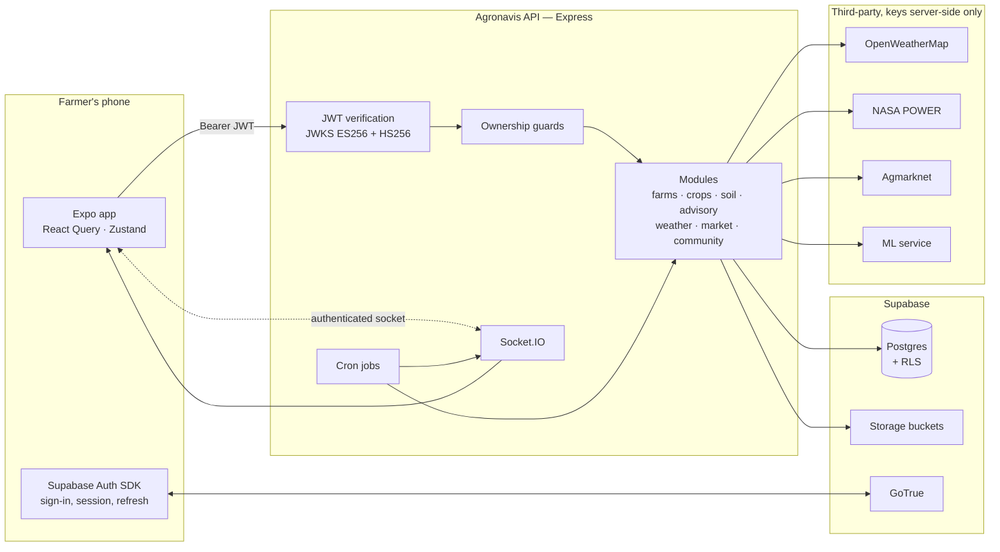
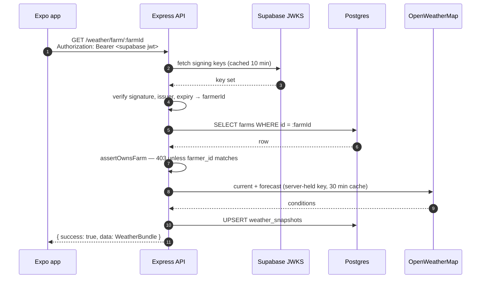
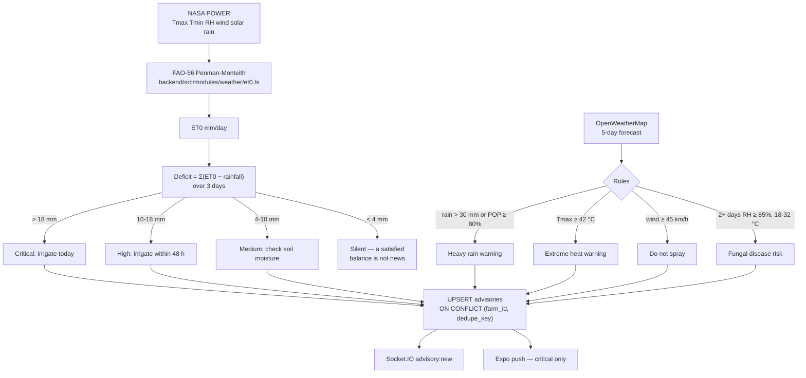
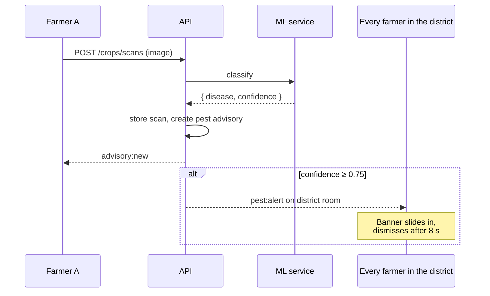
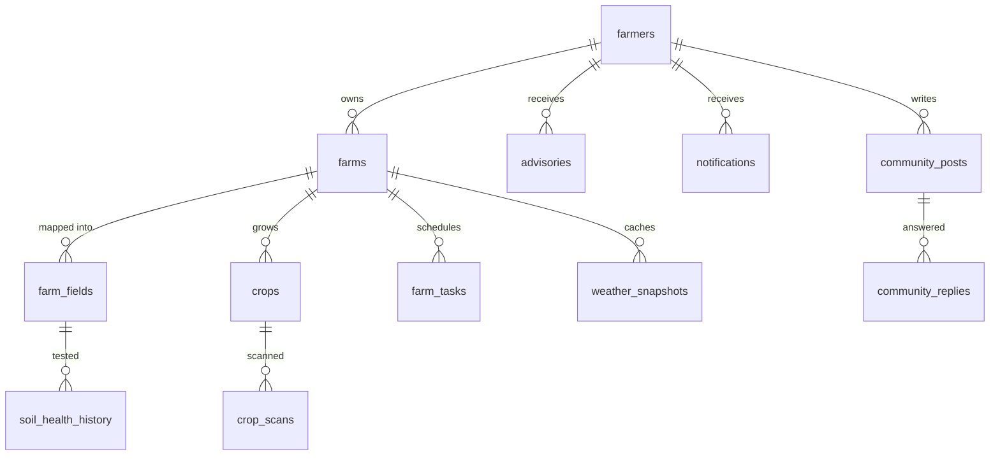
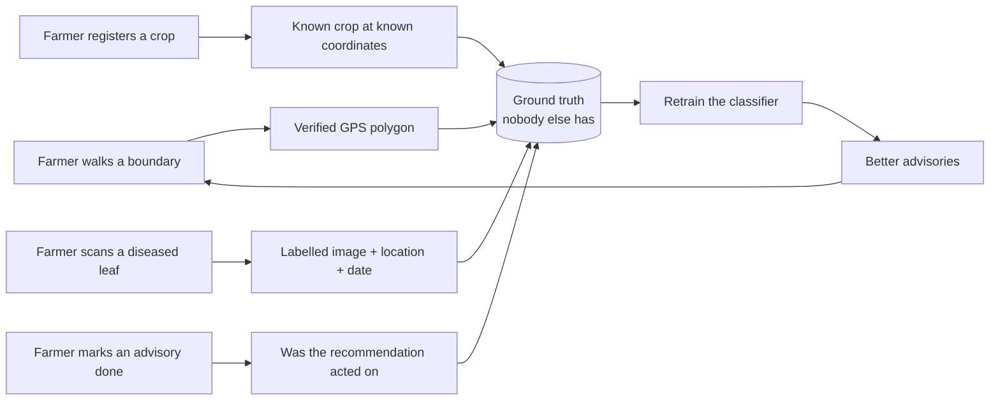

# Agronavis — System Architecture

AI-driven geospatial intelligence for Indian agriculture. One monorepo, one
database schema, one environment file, and exactly one path from the app to the
data.

---

## 1. The rule that shapes everything

**The mobile app never touches the database.** It authenticates with Supabase
Auth and sends that JWT to the Agronavis API; the API holds the service-role key
and every third-party API key, and is the only process that reads or writes.

That rule buys three things:

| | Before | Now |
|---|---|---|
| Secrets in the app bundle | OpenWeatherMap key shipped in the APK | Public Supabase anon key and Maps key only |
| Business logic | Split between 14 client files and the server | One place, testable, versioned |
| Access control | Row Level Security alone | Explicit ownership checks in the service layer, with RLS behind them |



---

## 2. Repository layout

```
Agronavis/
├── .env / .env.example      One environment file for the whole repo
├── .gitignore               One ignore file
├── package.json             Root scripts and shared tooling
├── tsconfig.base.json       Shared compiler options
│
├── supabase/
│   ├── migrations/          The only schema definition
│   └── seed/                Reference data generators
│
├── packages/shared-types/   Database, REST and realtime contracts (types only)
│
├── backend/                 Express API + Socket.IO + cron
│   └── src/
│       ├── config/          env, logger, supabase client
│       ├── middleware/      auth, validation, errors, request context
│       ├── shared/          errors, ownership guards, cache, http helpers
│       ├── modules/         one folder per domain
│       ├── websocket/       Socket.IO server and emitters
│       └── jobs/            weather and market pollers
│
├── apps/mobile/             Expo app
│   ├── services/            api client + typed endpoints
│   ├── hooks/               React Query hooks, one per domain
│   ├── components/ui/       Material 3 primitives
│   └── app/                 expo-router screens
│
├── docs/                    Architecture, API, deployment, external services
└── render.yaml              Render blueprint for the API
```

Each workspace keeps its own `package.json` because npm workspaces and Expo
require it. Everything else — scripts, formatting, TypeScript config, env,
ignore rules — lives once, at the root.

---

## 3. Request path



Every endpoint returns the same envelope, so the client has one success path and
one failure path:

```ts
{ success: true,  data: T, meta?: { count, cached } }
{ success: false, error: string, code?: string, details?: unknown }
```

If OpenWeatherMap is unreachable the API serves the stored snapshot with
`meta.cached = true`, and the dashboard says so rather than showing an error.

---

## 4. Advisory generation

The irrigation advisory is a real water balance, not a threshold on temperature.



`dedupe_key` is what makes a 30-minute poll safe: `irrigation:2026-09-04`
collides with itself, so the farmer gets one "irrigate today", not forty-eight.

---

## 5. Realtime

Sockets are authenticated at handshake with the same Supabase JWT, and joining a
farm room is ownership-checked. Without that, a guarded REST API would have an
unguarded side door.

| Room | Who joins | Events |
|---|---|---|
| `farmer:{id}` | Automatic, from the verified token | `notification:push` |
| `farm:{id}` | Only after `assertOwnsFarm` | `weather:update`, `advisory:new` |
| `district:{slug}` | Any signed-in user | `pest:alert`, `community:post` |
| `market:{state}` | Any signed-in user | `market:price` |



---

## 6. Background jobs

| Job | Schedule | Work |
|---|---|---|
| Weather poll | `*/30 * * * *` | Groups farms by coordinates rounded to ~1 km, so a village costs one upstream call. Stores snapshots, regenerates advisories, emits and pushes. |
| Market poll | `15 * * * *` | One query per state and commodity that farmers actually grow, capped at six per state. Caches into `market_prices`. |

Both are wrapped in an overlap guard: a slow run is skipped, never stacked.
`ENABLE_JOBS=false` turns them off for a second API replica.

---

## 7. Data model

`supabase/migrations/*.sql` is the only schema definition. Types are generated
from the live database into `packages/shared-types/src/database.types.ts`, which
both the API and the app compile against.



`farmers.id` is `auth.users.id` with `ON DELETE CASCADE`, so deleting the auth
user erases the farmer record — without it, account deletion fails and an
erasure request cannot be honoured. A signup trigger creates the row; the API
recreates it if the trigger ever failed, so a broken trigger cannot leave an
account permanently unusable.

Two tables are reference data rather than farmer data: `crop_varieties` (the
agronomy catalogue — duration, yield, water and NPK per variety) and
`crop_diseases` (symptoms and treatment per class). Both are readable by any
authenticated user and are cached for a day on the client.

---

## 8. The data flywheel



Public satellite data is available to everyone. Verified field boundaries paired
with what was actually grown there, and whether the advice was followed, are not.

---

## 9. Roadmap

**Shipped**

Repo consolidation; Supabase JWT auth replacing the Clerk mismatch; the full
REST surface with ownership guards; authenticated realtime; FAO-56 irrigation
advisories; live mandi prices; TOTP two-factor; Material 3 mobile UI.

**Not built, and not faked in the UI**

Automatic disease detection from a photo. The scan screen files the image
against the farm and asks the farmer to identify it from the `crop_diseases`
library; it does not print a confidence score for a model that does not exist.
Every scan filed this way is a labelled image, which is what a classifier would
need to be trained on.

**Next**

The disease classifier itself; Sahayak WebRTC consultation; vernacular voice
interface; offline-first persistence; XGBoost crop classifier over Sentinel-1
SAR and Sentinel-2 optical; the enterprise Next.js console for canal water
management, insurance verification and carbon MRV.
